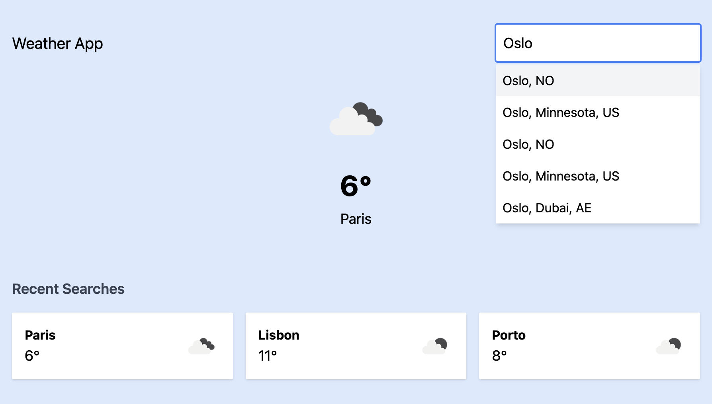

# [Weather App](https://weather-app-flax-two-99.vercel.app/)

A React weather application with geolocation support, city search, and recent searches history.\
[Assignment](ASSIGNMENT.md)

## Installation

1. Clone the repository: git clone https://github.com/mykytakhmelevskyi/weather_app.git
2. Run `npm install` to install the dependencies.
3. Run `npm start` to start the development server.
3. Create a `.env` file in the root directory using the `.env.example` file as a reference.
4. Set OPENWEATHERMAP_API_KEY in the `.env` file.
5. Run `npm run dev` to start the development server.

## Available Scripts

- `npm run dev` - Start development server
- `npm run build` - Build for production
- `npm run preview` - Preview production build
- `npm test` - Run unit tests
- `npm run test:coverage` - Run tests with coverage
- `npm run cypress:open` - Open Cypress Test Runner
- `npm run cypress:run` - Run Cypress tests headless

## Features

- Current weather display
- Geolocation support
- City search with autocomplete
- Recent searches history
- Temperature in Celsius
- Local storage for recent searches